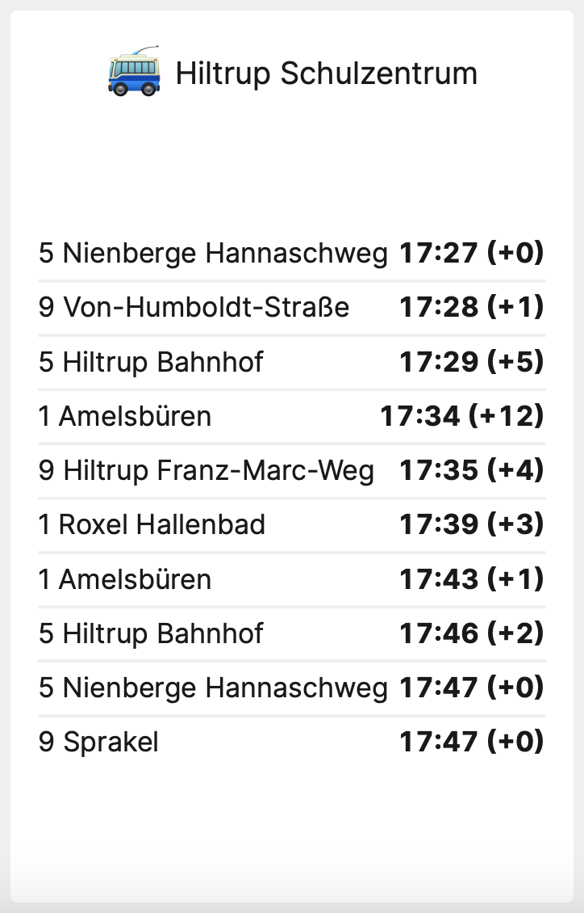

# A tile to display the next departures of busses in Münster (Germany)



[](https://packagist.org/packages/pschocke/laravel-dashboard-stadtwerke-muenster-bus-tile)

This tile can be used on the [Laravel Dashboard](https://docs.spatie.be/laravel-dashboard) to display the next departure of busses from a bus station in Münster.

## Installation

You can install the package via composer:

```bash
composer require pschocke/laravel-dashboard-stadtwerke-muenster-bus-tile
```

In the `dashboard` config file, you must add this configuration in the `tiles` key. The `stations` should contain an internal name for the station and all IDs of the bus stations that you want to display on one tile. You can add as many stations as you want.

You can find all stations and their ids [here](https://rest.busradar.conterra.de/prod/haltestellen).

```php
// in config/dashboard.php

return [
    // ...
    'tiles' => [
        'muenster-bus' => [
            'stations' => [
                'ludgeri' => 4102102,
                'schulzentrum' => [4725102, 4725101],
                'Friedrich-Ebert-Platz' => 4357102
            ]
        ]
    ]
];
```

In `app\Console\Kernel.php` you should schedule the `\Pschocke\MuensterBusTile\FetchMuensterBusStationsCommand` to run. You can let it run every minute if you want. You could also run it less frequently if fast updates on the dashboard aren't that important for this tile.

```php
// in app/console/Kernel.php

protected function schedule(Schedule $schedule)
{
    // ...
    $schedule->command(\Pschocke\MuensterBusTile\FetchMuensterBusStationsCommand::class)->everyMinute();
}
```

## Usage

In your dashboard view you use the `livewire:citybikes-tile` component. You need to specify the stations internal name defined in your config and a display name.

```html
<x-dashboard>
    <livewire:muenster-bus-tile position="b2:b4" station="schulzentrum" name="Hiltrup Schulzentrum"/>
</x-dashboard>
```

### Customizing the view

If you want to customize the view used to render this tile, run this command:

```bash
php artisan vendor:publish --provider="Pschocke\MuensterBusTile\MuensterBusTileServiceProvider" --tag="dashboard-muenster-bus-tile-views"
```

## Testing

```bash
composer test
```

## Contributing

Please see [CONTRIBUTING](CONTRIBUTING.md) for details.

### Security

If you discover any security related issues, please email patrick@ausbildung-ms.de instead of using the issue tracker.

## Credits

-   [Patrick Schocke](https://github.com/pschocke)
-   [All Contributors](../../contributors)